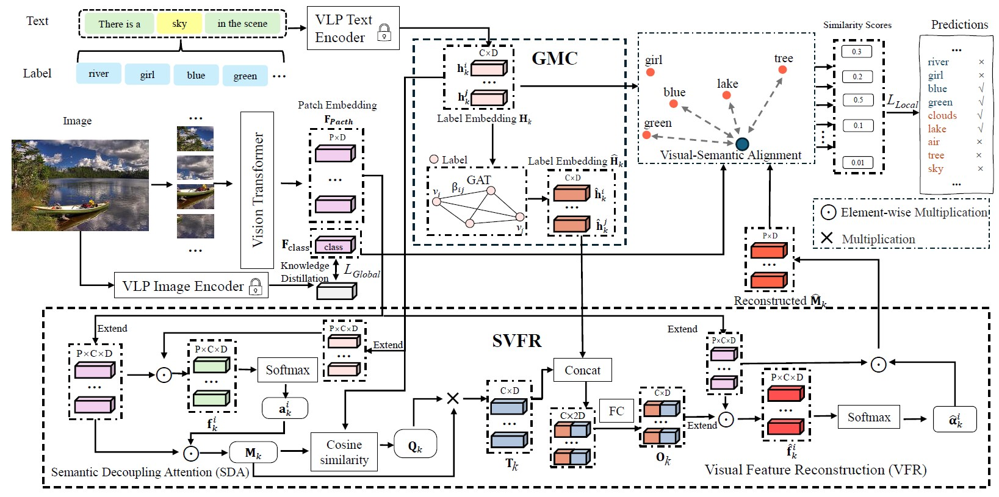

## Semantic-guided Representation Learning for Multi-Label Recognition (ICME 2025)

 

[](https://badges.pufler.dev/visits/MVL-Lab/SigRL)
 


Multi-label Recognition (MLR) involves assigning multiple labels to each data instance in an image, offering advantages over single-label classification in complex scenarios. However, it faces the challenge of annotating all relevant categories, often leading to uncertain annotations, such as unseen or incomplete labels. Recent Vision and Language Pre-training (VLP) based methods have made significant progress in tackling zero-shot MLR tasks by leveraging rich vision-language correlations. However, the correlation between multi-label semantics has not been fully explored, and the learned visual features often lack essential semantic information. To overcome these limitations, we introduce a Semantic-guided Representation Learning approach (SigRL) that enables the model to learn effective visual and textual representations, thereby improving the downstream alignment of visual images and categories. Specifically, we first introduce a graph-based multi-label correlation module (GMC) to facilitate information exchange between labels, enriching the semantic representation across the multi-label texts. Next, we propose a Semantic Visual Feature Reconstruction module (SVFR) to enhance the semantic information in the visual representation by integrating the learned textual representation during reconstruction. Finally, we optimize the image-text matching capability of the VLP model using both local and global features to achieve zero-shot MLR. Comprehensive experiments are conducted on several MLR benchmarks, encompassing both zero-shot MLR (with unseen labels) and single positive multi-label learning (with limited labels), demonstrating the superior performance of our approach compared to state-of-the-art methods.




## Two Challenges for Multi-Label Tasks 

```
(1) the exhaustive annotation of image datasets with a large number of categories, which is prohibitively laborintensive. --> Single Positive Multi-label Learning

(2) the possibility of novel categories (unseen labels) emerging during testing, even with meticulous annotation efforts.--> Open Vocabulary
```


## Single Positive Multi-label Learning

```
Single-Positive Multi-label Learning (SPML) is a weakly supervised machine learning paradigm where each training instance is annotated with only one positive label.
```

To train the Single Positive Multi-label Learning task: 

```
see in ./SPML/README.md
```


## Acknowledgement

We would like to thank [BiAM](https://github.com/akshitac8/BiAM) and [timm](https://github.com/rwightman/pytorch-image-models) for the codebase.

Many thanks to the author of 
[Open-Vocabulary Multi-Label Classification via Multi-modal Knowledge Transfer](https://github.com/sunanhe/MKT).
Our scripts are highly based on their scripts.

Many thanks to the authors of [Vision-Language Pseudo-Labels for Single-Positive Multi-Label Learning](https://github.com/mvrl/VLPL).[single-positive-multi-label](https://github.com/elijahcole/single-positive-multi-label) and [SPML-AckTheUnknown](https://github.com/Correr-Zhou/SPML-AckTheUnknown).

